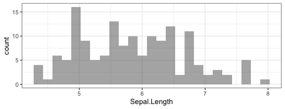

<!-- README.md is generated from README.Rmd. Please edit that file -->
fastR2
======

This package contains data sets and some utility functions to support [*Foundations and Applications of Statistics: An Introduction Using R*](https://bookstore.ams.org/amstext-28/) by Randall Pruim.

Installation
------------

The package can be installed from CRAN via

``` r
install.packages("fastR2")
```

or from github via

``` r
# install.packages("devtools")
devtools::install_github("rpruim/fastR2")
```

<!-- [](https://cran.r-project.org/package=fastR2) -->
### Snippets

In addtion to data sets, `fastR2` contains a `snippet()` function that loads and executes code found in the text. Here is an example:

``` r
require(fastR2)
snippet("histogram01")
#> 
#> ## snippet: histogram01
#> 
#> > gf_histogram( ~ Sepal.Length, data = iris)
```


