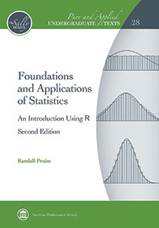

```{r setup, include=FALSE}
knitr::opts_chunk$set(
  echo = TRUE,
  fig.width = 4, fig.height = 2.5,
  fig.align = "center", fig.keep = "hold")
require(fastR2)
```



## Errata List

* A [list of detected errata](Errata2e.html) is available and will be updated as needed.  This is also available
as a vignette in the `fastR2` R package.


## fastR2 R package

The `fastR2` R package is available via [CRAN](https://CRAN.R-project.org/package=fastR2)

```{r, eval = FALSE}
install.packages("fastR2")
```

or GitHub

```{r, eval = FALSE}
library(devtools)
install_github("rpruim/fastR2", build_vignettes = TRUE)
```

Updates to the GitHub version of the package are more frequent than updates on CRAN.

### Snippets

Code chunks from the text can be executed using the `snippet()` function.

```{r}
require(fastR2)        # or library(fastR2)
theme_set(theme_bw())  # set theme for plots
snippet("histogram01") # execute the histogram01 snippet
```


### Bug reports

If you detect an problems with the R package, please post an [issue on GitHub](https://github.com/rpruim/fastR2/issues).

## Solutions to Exercises

I'm working on a set of solutions to the exercises in the text. Instructors may
request solutions to exercises by sending email to `rpruim` at `calvin.edu`.
Include a description of the course you are teaching and a link to your course
home page or other indicator that you are the instructor of a course using
*Foundations and Applications of Statistics*.


